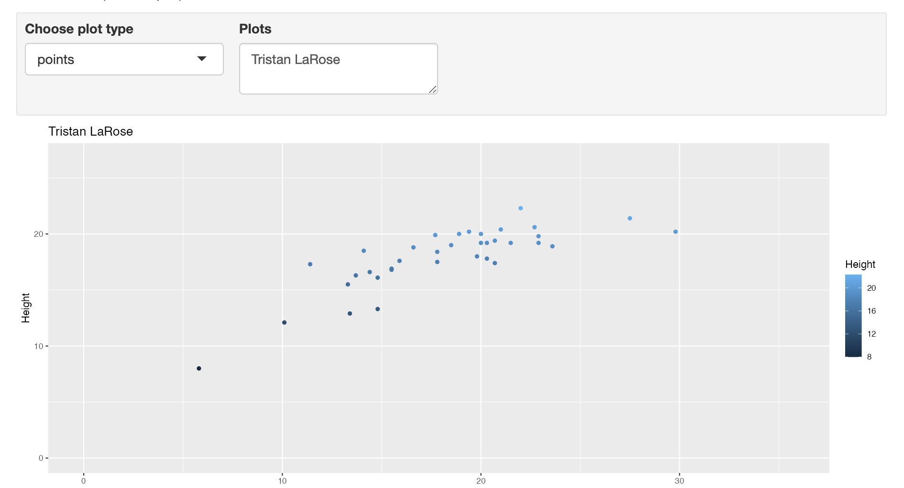
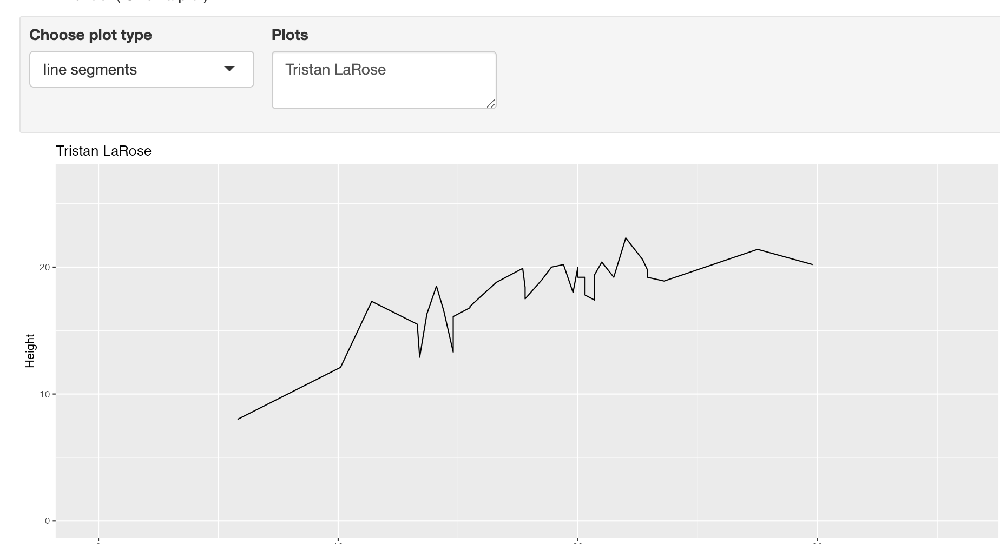
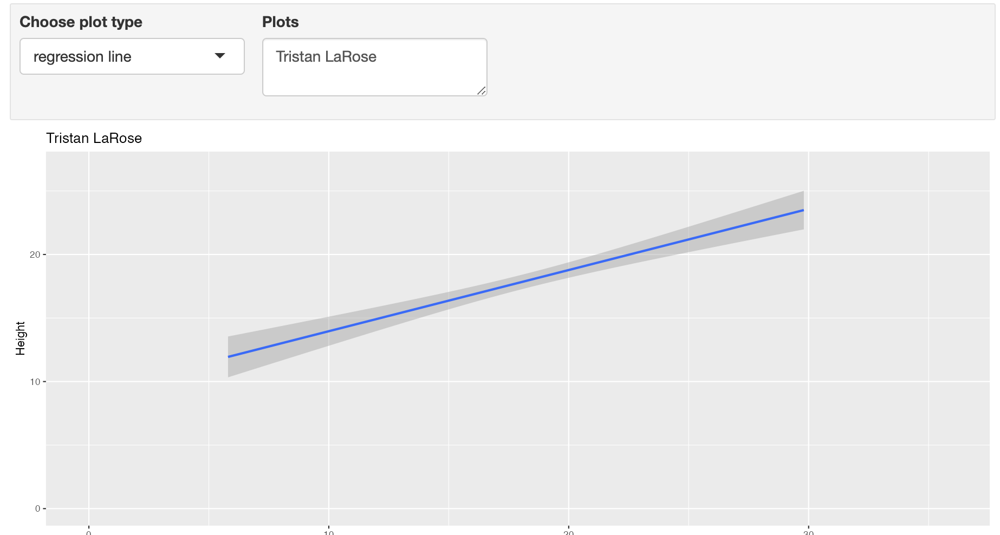

```{r setup, include=FALSE}
knitr::opts_chunk$set(echo = TRUE)
```

# Task 1

WD

```{r}
getwd()
```

# Task 2

```{r}
spruce.df = read.csv("SPRUCE.csv")
head(spruce.df)
```

# Task 3

Scatterplot of the data

```{r}
bhd <- spruce.df$BHDiameter

hgt <- spruce.df$Height

plot(hgt, bhd, xlab = "BHDiameter", ylab = "Height", main = "Height vs. BHDiameter", pch = 21, bg = "blue", cex = 1.2, ylim=c(0,1.1*max(hgt)), xlim=c(0,1.1*max(bhd)))

```

Optically, it appears to be very likely to have a straight line of best fit.

```{r}
library(s20x)
library(ggplot2)

lo <- layout(matrix(1:3,nr=3,nc=3,byrow=TRUE))

tsone <- trendscatter(hgt, bhd, xlab = "BHDiameter", ylab = "Height", main = "Height vs. BHDiameter", bg = "blue", cex = 0.8, f = 0.5)

tstwo <- trendscatter(hgt, bhd, xlab = "BHDiameter", ylab = "Height", main = "Height vs. BHDiameter", bg = "blue", cex = 0.8, f = 0.6)

tsthree <- trendscatter(hgt, bhd, xlab = "BHDiameter", ylab = "Height", main = "Height vs. BHDiameter", bg = "blue", cex = 0.8, f = 0.7)

layout.show(3)
```


```{r}
spruce.lm <- with(spruce.df, lm(Height~BHDiameter))
```


New Plot with Least Squares Regression

```{r}
lo <- layout(1)

with(spruce.df,
     plot(Height~BHDiameter, main = "Height vs. BHDiameter",
          xlab = "BHDiameter (cm)", ylab = "Height of Tree (m)",
          bg = "blue", pch = 21, cex = 1.2, 
          ylim = c(0, 1.1 * max(BHDiameter)))
)
abline(spruce.lm)
```

A straight line does not appear to be appropriate since the data seems to have a curve to it.

# Task 4

```{r}
lo <- layout(matrix(1:4, nr = 2, nc = 2, byrow = TRUE))


layout.show(4)

mycex = 1.0

```

```{r}
mycex = 1.0

with(spruce.df,
     plot(Height~BHDiameter, main = "Tree Height vs. BHDiameter",
          xlab = "BHDiameter (cm)", ylab = "Height (m)",
          bg = "Blue", pch=21, cex = mycex, 
          xlim = c(0, 1.1 * max(BHDiameter)), 
          ylim = c(0, 1.1 * max(Height)))
)
abline(spruce.lm)

yhat = with(spruce.df, predict(spruce.lm, data.frame(BHDiameter)))
yhat = fitted(spruce.lm)

with(spruce.df,
     plot(Height~BHDiameter, main = "RSS",
          xlab = "Breast Height Diameter (cm)", 
          ylab = "Height of Tree (m)", bg = "blue", pch=21, 
          cex = mycex, 
          ylim = c(0, 1.1 * max(Height)),
          xlim = c(0, 1.1 * max(BHDiameter)))
     )

with(spruce.df, {
  segments(BHDiameter, Height, BHDiameter, yhat)
  })
abline(spruce.lm)

with(spruce.df,
     plot(Height~BHDiameter, main = "MSS",
          xlab = "Breast Height Diameter (cm)", 
          ylab = "Height of Tree (m)", bg = "blue", pch=21, 
          cex = mycex, 
          ylim = c(0, 1.1 * max(Height)),
          xlim = c(0, 1.1 * max(BHDiameter)))
     )

with(spruce.df, abline(h = mean(Height)))
abline(spruce.lm)

with(spruce.df, segments(BHDiameter, mean(Height), BHDiameter, yhat, col = "red"))

with(spruce.df,
     plot(Height~BHDiameter, main = "TSS - Plot by Possible Student",
          xlab = "Breast Height Diameter (cm)", ylab = "Height of Tree (m)", bg = "blue", pch=21, cex = mycex,
          ylim = c(0, 1.1 * max(Height)),
          xlim = c(0, 1.1 * max(BHDiameter)))
     )
with(spruce.df, abline(h = mean(Height)))
with(spruce.df, segments(BHDiameter, Height, BHDiameter, mean(Height), col = "green"))
```
RSS
```{r}
RSS <- with(spruce.df, sum((Height - yhat) ^ 2))
RSS
```
MSS
```{r}
MSS <- with(spruce.df, sum((yhat - mean(Height)) ^ 2))
MSS
```
TSS
```{r}
TSS <- with(spruce.df, sum((Height - mean(Height)) ^ 2))
TSS
```
Calculate MSS/TSS, and interpret it!
```{r}
MSS/TSS
```
This has to do with R squared and how good of a fit our line is. Since it is not even 2/3, the line is not a great fit.

Does TSS=MSS+RSS?
```{r}
TSS

MSS + RSS
```

Yes TSS does equal MSS+RSS

# Task 5

Summarize spruce.lm paste it here.

```{r}
summary(spruce.lm)
```

The slope is: 0.48147
The intercept is: 9.14684
the line is y = 9.14684 + 0.48147x
A spruce tree of height 15, 18, and 20m, respectively:
```{r}
predict(spruce.lm, data.frame(BHDiameter=c(15,18,20)))
```
# Task 6

```{r}
library(ggplot2)
g <- ggplot(spruce.df, aes(x=BHDiameter,y=Height,colour=BHDiameter))
g <- g + geom_point() + geom_line() + geom_smooth(method="lm")
g+ggtitle("Height Vs BHDiameter")

```


# Me

```{r}
obj = lm(Height~BHDiameter, data = spruce.df)
summary(obj)
plot(Height~BHDiameter, data = spruce.df)
abline(obj)
library(s20x)
trendscatter(Height~BHDiameter,f=0.7, data=spruce.df)
```


#Task 7

This is how you place images in RMD documents

<center>
{ width=70% }
</center>

<center>
{ width=70% }
</center>

<center>
{ width=70% }
</center>


